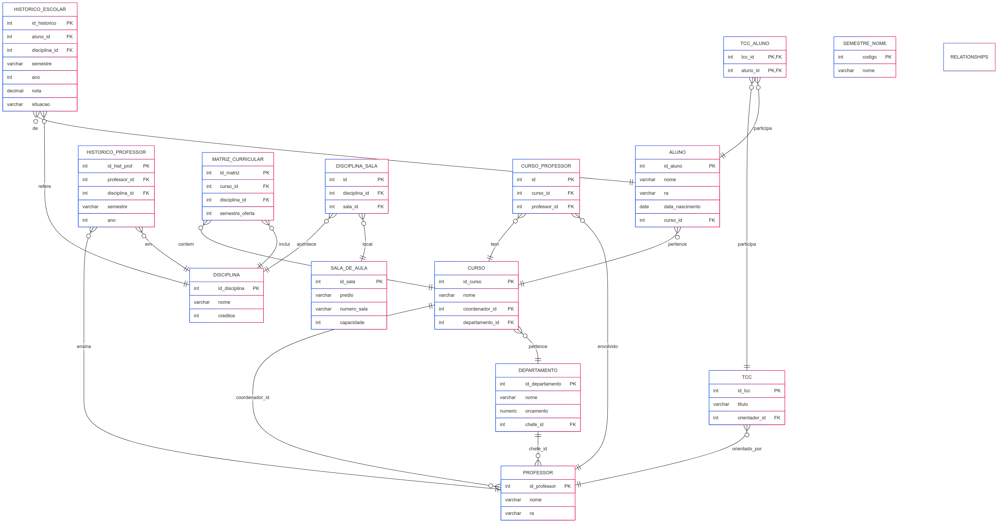
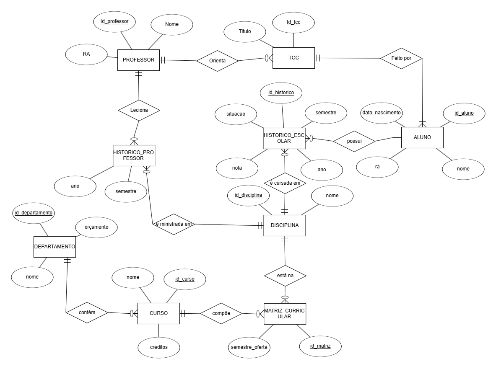

# Projeto de Banco de Dados - Sistema Universitário

## Integrantes do Grupo

- **Raphael Garavati Erbert** – RA: *[22.123.014-7]*
- **Nathan Gabriel da Fonseca Leite** – RA: *[22.123.028-7]*
- **Ana Carolina Lazzuri** – RA: *[22.123.001-4]*

---

## Descrição do Projeto

Este projeto consiste no desenvolvimento de um sistema de banco de dados relacional para simular a estrutura de uma universidade. O sistema permite armazenar e consultar dados de:

- Professores e suas disciplinas
- Alunos e seu histórico escolar
- Cursos, departamentos e matrizes curriculares
- Trabalhos de Conclusão de Curso (TCC)
- Salas de aula e distribuição de disciplinas

O banco de dados foi modelado com base em requisitos realistas e implementado no Supabase utilizando PostgreSQL.

---

## Como Executar o Projeto

### 1. Clone o repositório
```bash
git clone https://github.com/seuusuario/seurepositorio.git
cd seurepositorio
```

### 2. Configure as variáveis de ambiente

Crie um arquivo `.env` com o seguinte conteúdo:
```
SUPABASE_URL=https://<sua-instancia>.supabase.co
SUPABASE_KEY=sua-service-role-key
```

### 3. Instale as dependências
```bash
pip install -r requirements.txt
```

### 4. Execute os scripts do projeto

#### Popule o banco de dados com dados de exemplo:
```bash
python insert.py
```

#### Verifique a consistência dos dados inseridos:
```bash
python verification.py
```

#### Execute as queries solicitadas:
```bash
python teste_query.py
```

> Os arquivos estão organizados da seguinte forma:
> - `insert.py`: insere dados fictícios nas tabelas
> - `verification.py`: realiza verificações de consistência no banco
> - `teste_query.py`: executa 5 queries do enunciado + 10 queries adicionais

---

## Modelo Relacional (MR)



---

## Modelo Entidade-Relacionamento (MER)


