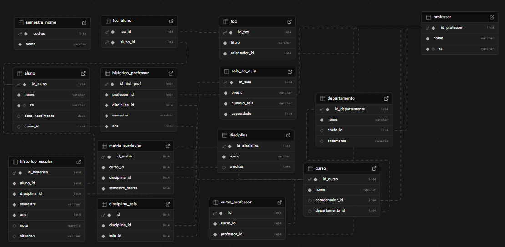

# Projeto de Banco de Dados - Sistema Universitário

## Integrantes do Grupo

- **Raphael Garavati Erbert** – RA: *[22.123.014-7]*
- **Nathan Gabriel da Fonseca Leite** – RA: *[22.123.028-7]*
- **Ana Carolina Lazzuri** – RA: *[22.123.001-4]*

---

## Descrição do Projeto

Este projeto consiste no desenvolvimento de um sistema de banco de dados relacional para simular a estrutura de uma universidade. O sistema permite armazenar e consultar dados de:

- Professores e suas disciplinas
- Alunos e seu histórico escolar
- Cursos, departamentos e matrizes curriculares
- Trabalhos de Conclusão de Curso (TCC)
- Salas de aula e distribuição de disciplinas

O banco de dados foi modelado com base em requisitos realistas e implementado no Supabase utilizando PostgreSQL.

---

## Como Executar o Projeto

### 1. Clone o repositório
```bash
git clone https://github.com/rapha661/banco_dados_fei
cd seurepositorio
```

### 2. Configure as variáveis de ambiente

Crie um arquivo `.env` com o seguinte conteúdo:
```
SUPABASE_URL=https://<sua-instancia>.supabase.co
SUPABASE_KEY=sua-service-role-key
```

### 3. Instale as dependências
```bash
pip install -r requirements.txt
```

### 4. Execute os scripts do projeto

### Crie a tabela com o DDL
```bash
CREATE SEQUENCE IF NOT EXISTS seq_ra_aluno START 100;

-- TABELA PROFESSOR
CREATE TABLE IF NOT EXISTS PROFESSOR (
    id_professor SERIAL PRIMARY KEY,
    nome VARCHAR(100) NOT NULL,
    ra VARCHAR(20) UNIQUE NOT NULL
);

-- TABELA DEPARTAMENTO
CREATE TABLE IF NOT EXISTS DEPARTAMENTO (
    id_departamento SERIAL PRIMARY KEY,
    nome VARCHAR(100) NOT NULL,
    chefe_id INT,
    orcamento NUMERIC(10,2),
    FOREIGN KEY (chefe_id) REFERENCES PROFESSOR(id_professor)
);

-- TABELA CURSO
CREATE TABLE IF NOT EXISTS CURSO (
    id_curso SERIAL PRIMARY KEY,
    nome VARCHAR(100) NOT NULL,
    coordenador_id INT,
    departamento_id INT,
    FOREIGN KEY (coordenador_id) REFERENCES PROFESSOR(id_professor),
    FOREIGN KEY (departamento_id) REFERENCES DEPARTAMENTO(id_departamento)
);

-- TABELA ALUNO
CREATE TABLE IF NOT EXISTS ALUNO (
    id_aluno SERIAL PRIMARY KEY,
    nome VARCHAR(100) NOT NULL,
    ra VARCHAR(20) UNIQUE NOT NULL DEFAULT nextval('seq_ra_aluno'),
    data_nascimento DATE,
    curso_id INT,
    FOREIGN KEY (curso_id) REFERENCES CURSO(id_curso)
);

-- TABELA DISCIPLINA
CREATE TABLE IF NOT EXISTS DISCIPLINA (
    id_disciplina SERIAL PRIMARY KEY,
    nome VARCHAR(100) NOT NULL,
    creditos INT
);

-- TABELA HISTÓRICO ESCOLAR
CREATE TABLE IF NOT EXISTS HISTORICO_ESCOLAR (
    id_historico SERIAL PRIMARY KEY,
    aluno_id INT NOT NULL,
    disciplina_id INT NOT NULL,
    semestre VARCHAR(10) NOT NULL,
    ano INT NOT NULL,
    nota DECIMAL(4,2),
    situacao VARCHAR(20),
    FOREIGN KEY (aluno_id) REFERENCES ALUNO(id_aluno),
    FOREIGN KEY (disciplina_id) REFERENCES DISCIPLINA(id_disciplina)
);

-- TABELA HISTÓRICO PROFESSOR
CREATE TABLE IF NOT EXISTS HISTORICO_PROFESSOR (
    id_hist_prof SERIAL PRIMARY KEY,
    professor_id INT NOT NULL,
    disciplina_id INT NOT NULL,
    semestre VARCHAR(10) NOT NULL,
    ano INT NOT NULL,
    FOREIGN KEY (professor_id) REFERENCES PROFESSOR(id_professor),
    FOREIGN KEY (disciplina_id) REFERENCES DISCIPLINA(id_disciplina)
);

-- TABELA MATRIZ CURRICULAR
CREATE TABLE IF NOT EXISTS MATRIZ_CURRICULAR (
    id_matriz SERIAL PRIMARY KEY,
    curso_id INT NOT NULL,
    disciplina_id INT NOT NULL,
    semestre_oferta INT NOT NULL,
    FOREIGN KEY (curso_id) REFERENCES CURSO(id_curso),
    FOREIGN KEY (disciplina_id) REFERENCES DISCIPLINA(id_disciplina)
);

-- TABELA TCC
CREATE TABLE IF NOT EXISTS TCC (
    id_tcc SERIAL PRIMARY KEY,
    titulo VARCHAR(200) NOT NULL,
    orientador_id INT NOT NULL,
    FOREIGN KEY (orientador_id) REFERENCES PROFESSOR(id_professor)
);

-- TABELA TCC_ALUNO
CREATE TABLE IF NOT EXISTS TCC_ALUNO (
    tcc_id INT NOT NULL,
    aluno_id INT NOT NULL,
    PRIMARY KEY (tcc_id, aluno_id),
    FOREIGN KEY (tcc_id) REFERENCES TCC(id_tcc),
    FOREIGN KEY (aluno_id) REFERENCES ALUNO(id_aluno)
);

-- TABELA SALA DE AULA
CREATE TABLE IF NOT EXISTS SALA_DE_AULA (
    id_sala SERIAL PRIMARY KEY,
    predio VARCHAR(100) NOT NULL,
    numero_sala VARCHAR(10) NOT NULL,
    capacidade INT NOT NULL
);

-- RELAÇÃO ENTRE DISCIPLINA E SALA
CREATE TABLE IF NOT EXISTS DISCIPLINA_SALA (
    id SERIAL PRIMARY KEY,
    disciplina_id INT NOT NULL REFERENCES DISCIPLINA(id_disciplina),
    sala_id INT NOT NULL REFERENCES SALA_DE_AULA(id_sala)
);

-- TABELA PARA NOMES DOS SEMESTRES (Primavera, Outono...)
CREATE TABLE IF NOT EXISTS SEMESTRE_NOME (
    codigo INT PRIMARY KEY,
    nome VARCHAR(20) NOT NULL
);

-- RELAÇÃO ENTRE PROFESSOR E CURSO (caso queira associar professor além de coordenador)
CREATE TABLE IF NOT EXISTS CURSO_PROFESSOR (
    id SERIAL PRIMARY KEY,
    curso_id INT NOT NULL REFERENCES CURSO(id_curso),
    professor_id INT NOT NULL REFERENCES PROFESSOR(id_professor)
);
```

#### Popule o banco de dados com dados de exemplo:
```bash
python insert.py
```

#### Verifique a consistência dos dados inseridos:
```bash
python verification.py
```

#### Execute as queries solicitadas:
```bash
python teste_query.py
```

> Os arquivos estão organizados da seguinte forma:
> - `insert.py`: insere dados fictícios nas tabelas
> - `verification.py`: realiza verificações de consistência no banco
> - `teste_query.py`: executa 5 queries do enunciado + 10 queries adicionais

---

## Modelo Relacional (MR)



---

## Modelo Entidade-Relacionamento (MER)


