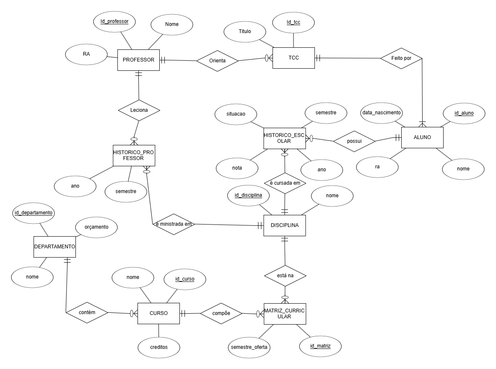

# 📚 Projeto 1 – Banco de Dados para uma Universidade

## 👥 Integrantes do Projeto

| Nome              | RA           |
|-------------------|--------------|
| Raphael Garavati  | 22.123.014-7 |
| Nathan Gabriel    | 22.123.028-7 |
| Ana Carolina      | 22.123.001-4 |

## 📌 Descrição

O projeto **"Banco de Dados para uma Universidade"** tem como objetivo a criação e implementação de um sistema de banco de dados que atenda às necessidades de gerenciamento acadêmico e administrativo de uma universidade.

Esse sistema será capaz de armazenar e gerenciar informações relacionadas a:

- Alunos  
- Professores  
- Departamentos  
- Cursos  
- Disciplinas  
- Históricos escolares de alunos  
- Disciplinas lecionadas por professores  
- Trabalhos de Conclusão de Curso (TCCs), incluindo os grupos de alunos e seus respectivos orientadores

## ▶️ Como Executar 

## 📸 Diagramas

